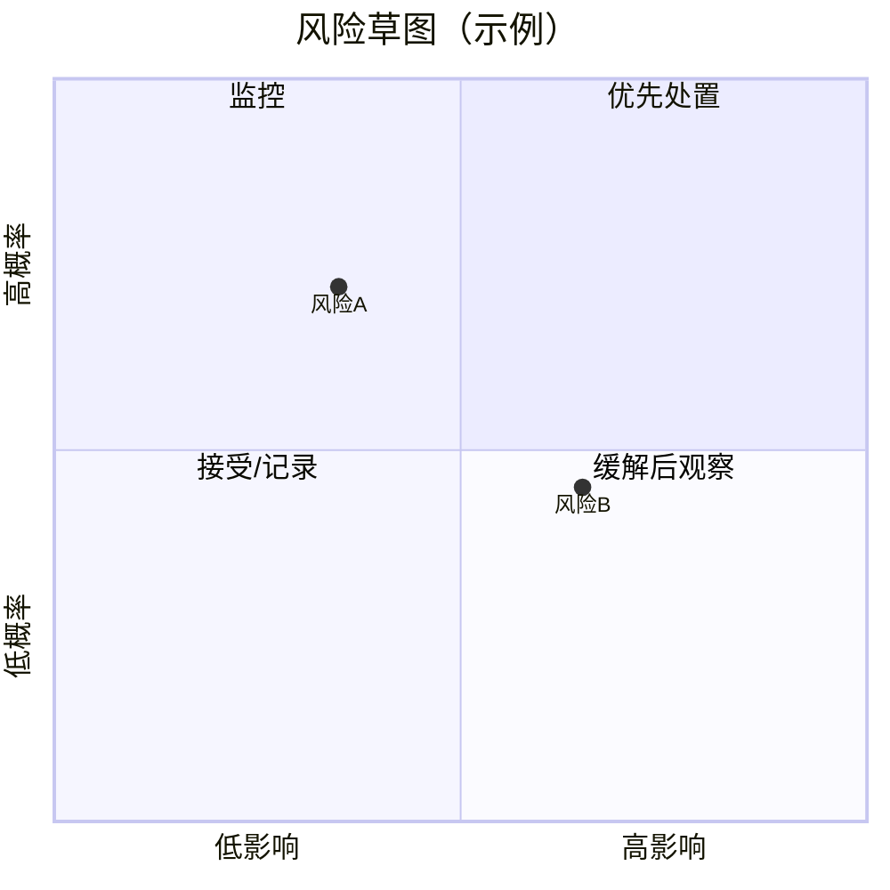
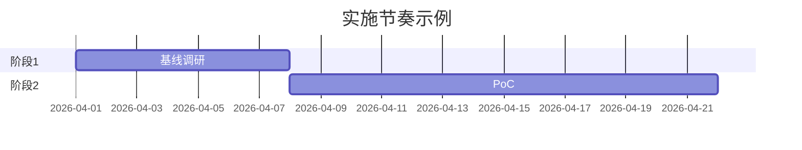

# damn 报告图表与可视化（渐进披露）

仅在用户明确要求「配图、可发表级图表、幻灯片用图」或竞品/ROI 数据已**数值化**时加载本文。默认阶段五仍以 **Markdown 表格 + 文字** 为主，避免无依据的伪图表。

## 目录

1. [选用顺序](#选用顺序)
2. [Mermaid（零依赖，报告内嵌）](#mermaid零依赖报告内嵌)
3. [Python 脚本（确定性出 PNG）](#python-脚本确定性出-png)
4. [图表类型与数据要求](#图表类型与数据要求)
5. [反例（不要做）](#反例不要做)

---

## 选用顺序

1. **表格**已足够时：不画图。
2. **流程、阶段、依赖**：用 **Mermaid**（`flowchart` / `gantt`）。
3. **多维方案对比、热力矩阵、敏感性、置信度序列**：数值齐全时，写 **`damn-charts.json`**（见 `references/damn-charts.example.json`），运行 `scripts/render_damn_charts.py` 生成 PNG。

---

## Mermaid（零依赖，报告内嵌）

### 风险四象限（定性）

### 落地甘特（有明确周次时）

### 证据/阶段流程

---

## Python 脚本（确定性出 PNG）

- **命令**：`python3 scripts/render_damn_charts.py -i damn-charts.json -o ./damn-charts-out`
- **依赖**：`matplotlib`（`pip install matplotlib`）
- **输入**：单文件 JSON；字段均为可选，仅渲染存在的块。

---

## 图表类型与数据要求

| 类型 | JSON 块名 | 何时用 | 数据要求 |
|------|-----------|--------|----------|
| 方案×指标热力图 | `heatmap` | 竞品矩阵已是 1–10 分或可比数值 | `rows`, `cols`, `values` 二维数组对齐 |
| 方案雷达图 | `radar` | Top 3 方案、同一套维度可比 | `alternatives`, `axes`, `scores`（与轴顺序一致） |
| 分组柱图 | `grouped_bar` | 各方案在少数指标上并列对比 | `categories`, `series`（名→各 category 数值列表） |
| 来源质量条图 | `source_bars` | 阶段三来源打分展示 | `sources`: `{name, score}`，`score` 0–10 |
| 敏感性龙卷风 | `tornado` | ROI/TCO 有 baseline 与上下界倍数 | `baseline`, `variables`: `name`, `low`, `high`（相对 baseline 的乘数） |
| 置信度折线 | `confidence_line` | 有明确的逐轮或逐步置信度序列 | `labels`, `values`（0–100） |

数值须与报告正文、表格一致，并在报告里 **引用生成的文件名** 与数据出处。

---

## 反例（不要做）

- 无具体数字仍画雷达/热力图「示意」——易误导。
- 把未校准的主观分画成精确小数图表——优先保留在表格并标置信度。
- 为画图而画图：增加维护成本且无决策增量时跳过。
