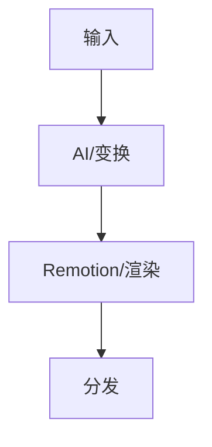

# damn 对话内展示微件（Cursor / Codex / Claude）

默认报告态是 **L0 对话态**：Markdown 表 + Mermaid + 短状态词。  
完整 doctor JSON、伪 JSON 长行、多行 ASCII 框线图 **禁止**作为人类扫读主路径。

导出层见文末「三层可视化」。微件可直接粘贴进阶段输出。

## 总规则

| 规则 | 约束 |
| --- | --- |
| 表尺寸 | ≤8 行 × ≤6 列；单元格 ≤20 字（中文） |
| 状态词 | 只用：`通过` / `降级` / `不可用` / `未配` / `跳过` / `高|中|低` / `1–5` |
| 禁止 | doctor 原文长串；`search_intent: {…}` 伪 JSON 墙；`+---+` 框线流程（>5 行） |
| 流程 | 默认 Mermaid `flowchart`；宿主不支持时退化为单行 `A → B → C` |
| 热力 | 评分表用 `■■■` / `■■□` / `■□□`（或 `●●●`）；**勿与金额混在同一表** |
| 证据 | 关键数字旁标 `L1`–`L4`；账本用下表，勿把 Lx 只埋在段落里 |

---

## 阶段一头（问题卡）

```markdown
【阶段一】复杂度 [Low|Medium|High] · [快速|标准|深度] · ROI [是|否] · 多角色 [是|否]

| 项 | 内容 |
| --- | --- |
| 核心目标 | 1) …；2) …；3) …（≤3 条，或表下 bullet） |
| problem_type | 主 / 次 |
| 决策权重 | w1 · w2 · w3 · w4 |
| 复杂度理由 | ≤40 字 |
```

快速模式可压成 4 行表，省略「理由」列外的散文。

---

## 阶段二头（探测卡）— 禁止 CapabilityProfile 长行

```markdown
【阶段二】复杂度 [L|M|H] · [problem_type] · 发现通道 [n]/≥2 [通过|降级]

| 项 | 状态 |
| --- | --- |
| 发现通道 | A · B · C — ≥2 通过（或 single_adapter + fallback_won） |
| 深读策略 | 已知 URL→WebFetch；失败再 scrape |
| 本地工具 | python3 / curl / gh / … |
| 增强层 | agent_reach 不可用 · Brave/Exa key 未配 |
| 搜索意图 | kind · domain · freshness |

| 源类 | 数量 | 理由（≤12 字） |
| --- | --- | --- |
| 一手实验 | N 或 跳过 | … |
| 官方文档 | N | … |
| … | … | … |

优先级: …（一行）  
工具计划: …（一行）  
总数控制: Low≤8 / Medium≤15 / High≤25
```

**附录（默认不展开）:** 仅当 routing 争议或用户追问时贴 `CapabilityProfile raw`（doctor/--json 摘要）。探测字段仍须在内部满足硬门禁；**展示**不得复述成长墙。

---

## 阶段三完成条

```markdown
【阶段三】[N]/[上限] · [串行|并行] · 关键发现 3 条

| ID | 断言摘要 | Lx | 渠道 | 局限 |
| --- | --- | --- | --- | --- |
| E1 | … | L2 | official | … |
| E2 | … | L3 | web | 自报营收 |

- 发现 1
- 发现 2
- 发现 3
```

快速模式可只保留完成条 + 3 条发现，账本合并进阶段五。

---

## 阶段四角色（标准/深度）

一行合题表即可；禁止五段重复长文。

```markdown
| 角色 | 合题（≤30 字） |
| --- | --- |
| 架构 | … |
| 产品 | … |
| 成本 | …（ROI 未启用则省略） |
| 行业 | … |
| 决策 | … |
```

---

## 阶段五开篇决策卡（标准/深度强制）

放在报告最前；**过程阶段不得再写第二份执行摘要**。

```markdown
### 决策卡
**结论:** …（含适用边界）

| 方案 | [w1] | [w2] | [w3] | [w4] | 推荐 |
| --- | --- | --- | --- | --- | --- |
| A | ■■■ | ■■□ | … | … | ✓ |
| B | … | … | … | … | |

置信度 72%  [███████░░░]  档: 60–79 · 缺[审计财报]会降 / 有[L1 账单]会升
```

热力与金额分表：金额/ROI 数字另开「数字表」。

---

## 置信度条与贝叶斯一行表

```text
置信度 [NN]%  [████████░░]  档: ≥80 | 60–79 | <60
```

| 先验 | 新证据 (Lx) | 后验 |
| --- | --- | --- |
| 65% | … (L3) | 72% |

---

## Mermaid 工作流（每 Top 方案 ≤1 张，节点 ≤12）

````markdown

````

禁止用多行 ASCII 框线替代（除非声明宿主无 Mermaid，改用单行箭头链）。

---

## 三层可视化（统一叙事）

| 层 | 何时 | 形态 |
| --- | --- | --- |
| **L0 对话态** | 默认 `/damn` | 本文件微件：表 + Mermaid + 置信度条 |
| **L1 归档态** | 用户要「导出 Markdown / 归档」 | `scripts/generate_markdown_report.py` |
| **L2 发表态** | 用户要 HTML / PNG / 幻灯 | `generate_html_report.py` / `render_damn_charts.py`；见 `chart-playbook.md` |

ASCII 柱图/框线仅作 **无 Mermaid 时的 L0 fallback**，不是默认主方案。
