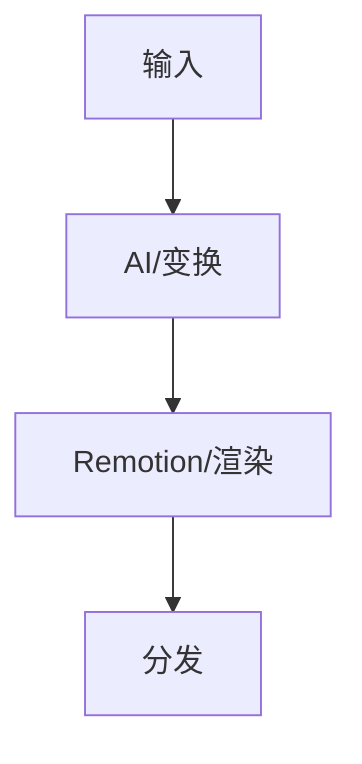

# damn 对话内展示微件（Cursor / Codex / Claude）

默认报告态是 **L0 对话态**：Markdown 表 + Mermaid + 短状态词。  
完整 doctor JSON、伪 JSON 长行、多行 ASCII 框线图 **禁止**作为人类扫读主路径。

导出层见文末「三层可视化」。微件可直接粘贴进阶段输出。

## 总规则

| 规则 | 约束 |
| --- | --- |
| 表尺寸 | ≤8 行 × ≤6 列；单元格 ≤20 字（中文） |
| 状态词 | 只用：`通过` / `降级` / `不可用` / `未配` / `跳过` / `高|中|低` / `0–5`（可 `.5`） |
| 禁止 | doctor 原文长串；`search_intent: {…}` 伪 JSON 墙；`+---+` 框线流程（>5 行） |
| 流程 | 默认 Mermaid `flowchart`；宿主不支持时退化为单行 `A → B → C` |
| 热力 | 5 格点阵，步进 0.5：`●` 整 / `◐` 半 / `○` 空；禁止三格 `■■■`；**勿与金额混表** |
| 证据 | 关键数字旁标 `L1`–`L4`；账本用下表，勿把 Lx 只埋在段落里 |

---

## 阶段一头（问题卡）— 仅标准/深度

快速模式不要粘贴本卡；对人回复从快速契约的一句话结论开始。

```markdown
【阶段一】复杂度 [Low|Medium|High] · [快速|标准|深度] · ROI [是|否] · 多角色 [是|否]

| 项 | 内容 |
| --- | --- |
| 核心目标 | 1) …；2) …；3) …（≤3 条，或表下 bullet） |
| problem_type | 主 / 次 |
| 决策权重 | w1 · w2 · w3 · w4 |
| 复杂度理由 | ≤40 字 |
```

标准/深度用上表。快速模式不输出本卡。

---

## 阶段二头（探测卡）— 禁止 CapabilityProfile 长行

```markdown
【阶段二】复杂度 [L|M|H] · [problem_type] · 发现通道 [n]/≥2 [通过|降级]

| 项 | 状态 |
| --- | --- |
| 发现通道 | A · B · C — ≥2 通过（或 single_adapter + fallback_won） |
| 深读策略 | 已知 URL→WebFetch；失败再 scrape |
| 本地工具 | python3 / curl / gh / … |
| 增强层 | agent_reach 不可用 · Brave/Exa key 未配 |
| 搜索意图 | kind · domain · freshness |

| 源类 | 数量 | 理由（≤12 字） |
| --- | --- | --- |
| 一手实验 | N 或 跳过 | … |
| 官方文档 | N | … |
| … | … | … |

优先级: …（一行）  
工具计划: …（一行）  
总数控制: Low≤8 / Medium≤15 / High≤25
```

**附录（默认不展开）:** 仅当 routing 争议或用户追问时贴 `CapabilityProfile raw`（doctor/--json 摘要）。探测字段仍须在内部满足硬门禁；**展示**不得复述成长墙。

---

## 阶段三完成条

```markdown
【阶段三】[N]/[上限] · [串行|并行] · 关键发现 3 条

| ID | 断言摘要 | Lx | 渠道 | 局限 |
| --- | --- | --- | --- | --- |
| E1 | … | L2 | official | … |
| E2 | … | L3 | web | 自报营收 |

- 发现 1
- 发现 2
- 发现 3
```

标准/深度用上表。快速模式不贴完成条，发现并进契约的证据块。

---

## 阶段四角色（标准/深度）

一行合题表即可；禁止五段重复长文。

```markdown
| 角色 | 合题（≤30 字） |
| --- | --- |
| 架构 | … |
| 产品 | … |
| 成本 | …（ROI 未启用则省略） |
| 行业 | … |
| 决策 | … |
```

---

## 阶段五开篇决策卡（标准/深度强制）

放在报告最前。过程阶段不得再写第二份执行摘要。分章之后用「收束」，不要用执行摘要顶替尾巴。

```markdown
### 决策卡
**结论:** …（含适用边界）

| 方案 | [w1] | [w2] | [w3] | [w4] | 推荐 |
| --- | --- | --- | --- | --- | --- |
| A | ●●●●● | ●●●◐○ | … | … | ✓ |
| B | … | … | … | … | |

置信度 72%  [███████░░░]  档: 60–79 · 缺[审计财报]会降 / 有[L1 账单]会升
```

热力与金额分表：金额/ROI 数字另开「数字表」。

**5 格点阵（必用）**：长度固定 5，从左填。分值 `0–5`，只允许 **0.5 步进**（11 档）。整格 `●`，半格 `◐`（U+25D0 左半黑），空格 `○`，不加空格。

`full = floor(s)`；若 `s - full == 0.5` 则下一格用 `◐`。

| 分 | 条 |
| --- | --- |
| 0 | `○○○○○` |
| 0.5 | `◐○○○○` |
| 1 | `●○○○○` |
| 1.5 | `●◐○○○` |
| 2 | `●●○○○` |
| 2.5 | `●●◐○○` |
| 3 | `●●●○○` |
| 3.5 | `●●●◐○` |
| 4 | `●●●●○` |
| 4.5 | `●●●●◐` |
| 5 | `●●●●●` |

禁止：三格 `■■■`、0.25 等更细步进、用 `◑`（右半黑，方向反了）。

**UI**：对话 L0 用 Unicode `◐` 即可（系统字体 Geometric Shapes）。导出 HTML 时半格可做成圆：`border-radius:50%` + `background: linear-gradient(to right, var(--fill) 50%, var(--empty) 50%)`，视觉与 `◐` 同向。不必为半格上 canvas。置信度条仍用 10 格 `█/░`。

---

## 收束（标准/深度强制，放在证据账本之后、下一步之前）

一条分章里没有的判断。标准 120–180 字，深度不超过 250 字。四句，多一句就删。

```markdown
### 收束

选 A，边界是 …。E2 与 E4 合在一起才支持这个判断，单看任何一条都不够。B 不能并进来，因为 …。若 … 被测到，这个判断作废。
```

| 句 | 写什么 | 不写什么 |
| --- | --- | --- |
| 1 判断 | 选什么，边界 | 决策卡的换句话 |
| 2 建构 | 证据 ID 如何合取 | 「第 N 节说了」 |
| 3 没选的 | 淘汰项为何不能并进 | 优缺点清单 |
| 4 还开着 | 哪一个事实会推翻它 | 新的调研范围 |

快速模式不另起本块；一句话结论已经承担判断。

---

## 置信度条与贝叶斯一行表

```text
置信度 [NN]%  [████████░░]  档: ≥80 | 60–79 | <60
```

| 先验 | 新证据 (Lx) | 后验 |
| --- | --- | --- |
| 65% | … (L3) | 72% |

---

## Mermaid 工作流（每 Top 方案 ≤1 张，节点 ≤12）

````markdown

```mermaid
flowchart TD
  A[输入] --> B[AI/变换]
  B --> C[Remotion/渲染]
  C --> D[分发]
```
````

禁止用多行 ASCII 框线替代（除非声明宿主无 Mermaid，改用单行箭头链）。

---

## 三层可视化（统一叙事）

| 层 | 何时 | 形态 |
| --- | --- | --- |
| **L0 对话态** | 默认 `/damn` | 本文件微件：表 + Mermaid + 置信度条 |
| **L1 归档态** | 用户要「导出 Markdown / 归档」 | `scripts/generate_markdown_report.py` |
| **L2 发表态** | 用户要 HTML / PNG / 幻灯 | `generate_html_report.py` / `render_damn_charts.py`；见 `chart-playbook.md` |

ASCII 柱图/框线仅作 **无 Mermaid 时的 L0 fallback**，不是默认主方案。
